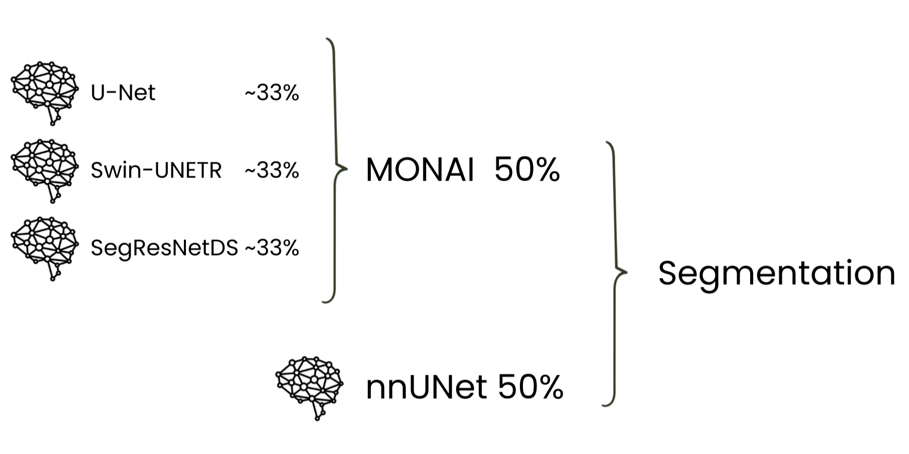
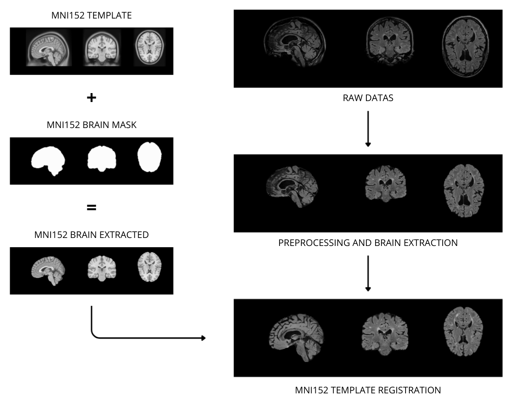

# MS-LENSES: Multiple Sclerosis Lesion ENsemble SEgmentation System [](LICENSE)

A robust deep learning ensemble for automatic segmentation of Multiple Sclerosis lesions in 3D FLAIR MRI scans, combining the strengths of MONAI and nnUNet frameworks.

### Overview

MS-LENSES implements a sophisticated ensemble approach that combines four state-of-the-art neural network architectures to achieve accurate and reliable MS lesion detection. The system integrates three MONAI-based models (UNet with residual units, Swin-UNETR, and SegResNetDS) with a self-configuring nnUNet model, leveraging their complementary strengths through weighted averaging. The pipeline handles the complete workflow from raw FLAIR images to final segmentation masks, including preprocessing, inference, and postprocessing with adaptive hysteresis thresholding.

Model predictions are combined using validation performance-weighted averaging based on Dice similarity coefficients, with a final 50/50 ensemble between MONAI models and nnUNet to balance their different strengths.



### Key Features

**Comprehensive Preprocessing Pipeline**

The system standardizes input FLAIR images through a multi-step pipeline that ensures consistent data quality. N4 bias field correction removes intensity inhomogeneities caused by scanner artifacts, while HD-BET performs robust brain extraction with GPU acceleration when available. Finally, non-linear SyN registration aligns each image to MNI152 standard space, enabling the neural networks to operate on normalized anatomy. All transformation matrices are preserved to enable accurate mapping back to the original patient space.



**Advanced Postprocessing**

Beyond standard thresholding, MS-LENSES implements a FLAIR-adaptive hysteresis algorithm that intelligently refines segmentation boundaries. The method grows lesion regions from high-confidence seeds, dynamically adjusting probability thresholds based on local FLAIR intensity similarity. This approach allows aggressive expansion in tissue with similar intensities while maintaining strict requirements in dissimilar regions, effectively reducing false positives while preserving true lesion boundaries. All predictions are automatically transformed back to the original patient space, providing multiple output formats including binary masks, probability maps, and the refined hysteresis-thresholded segmentation.

### Installation

Clone the repository and install dependencies:
```bash
git clone https://github.com/ChiccoSechi/MS-LENSES.git
cd MS-LENSES/mslenses
pip install -r requirements.txt
```
Then download the pre-trained models from Zenodo:
[Download models.zip from Zenodo](https://zenodo.org/records/18208365/files/models.zip)

Or download directly from terminal:
```bash
# Linux with wget
wget https://zenodo.org/records/18208365/files/models.zip

# Windows/Linux with curl
curl -L -O https://zenodo.org/records/18208365/files/models.zip

Extract `models.zip` in the `mslenses/` directory:
```bash
unzip models.zip
```

This will create the following directories:
- `models/` (contains UNet.pth, SwinUNETR.pth, SegResNetDS.pth)
- `nnUNet/` (contains checkpoint_best.pth)

### Requirements

The system has been tested with Python 3.11 and requires Python versions below 3.12 for compatibility with all dependencies. A CUDA-capable GPU is strongly recommended for practical use, as CPU inference is significantly slower. For optimal performance during brain extraction, at least 16GB of GPU memory is recommended, though the system will automatically fall back to CPU processing if insufficient memory is detected.


Core dependencies:
```txt
monai==1.5.1
antspyx==0.6.1
nibabel==5.3.2
numpy==1.26.4
nnunetv2==2.6.2
HD-BET==2.0.1
```

### USage

**Basic Usage**

Process a FLAIR image with default settings:

```bash
python Ensemble.py --input /path/to/flair.nii.gz

# short version:
python Ensemble.py -i /path/to/flair.nii.gz
```

or by placing the MRI in the MS-LENSES folder:

```bash
python Ensemble.py --input flair.nii.gz

# short version:
python Ensemble.py -i flair.nii.gz
```

**Advanced Options**

Skip preprocessing for already-processed images:

```bash 
Ensemble.py -i preprocessed_flair.nii.gz --preprocessed
```

Customize hysteresis thresholding parameters for any experiments (default values are already preset):
```bash
Ensemble.py -i flair.nii.gz
            --low_threshold 0.2
            --high_threshold 0.7
            --sigma 0.15
            --connectivity 18

# short version:
Ensemble.py -i flair.nii.gz
            -lt 0.2
            -ht 0.7
            -s 0.15
            -c 18
```

### Parameters

- `-i, --input`: Path to input FLAIR image (required, must be .nii.gz format)
- `--preprocessed`: Skip preprocessing (N4 correction and brain extraction) if already done
- `-lt, --low_threshold`: Minimum probability threshold for hysteresis (default: 0.3)
- `-ht, --high_threshold`: High-confidence seed threshold (default: 0.6)
- `-s, --sigma`: FLAIR similarity bandwidth parameter (default: 0.1)
- `-c, --connectivity`: Voxel neighborhood connectivity, options: 6, 18, 26 (default: 6)

## Pipeline Stages

### 1. Preprocessing
- Applies N4 bias field correction to normalize intensities
- Performs brain extraction using HD-BET
- Registers image to MNI152 template space using non-linear SyN registration
- Saves transformation matrices for later inverse mapping

### 2. Inference
- Preprocesses data for inference using a MONAI transformation pipeline: **CropForeground** removes background, **NormalizeIntensity** standardizes voxel values, **DivisiblePad** ensures compatibility with network architectures, and **CenterSpatialCrop** extracts a fixed-size region
- Runs inference through all four models
- Combines predictions using weighted averaging based on validation performance
- Generates both binary masks and probability maps

### 3. Postprocessing
- Transforms predictions back to original patient space using saved inverse transformations
- Applies FLAIR-adaptive hysteresis thresholding that considers local intensity similarity
- Produces final refined segmentation masks

## Output Files

All results are saved in the `work_dir/` directory:

- `*_preprocessed.nii.gz`: FLAIR image registered to MNI152 space
- `*_preprocessed_binary.nii.gz`: Binary segmentation mask in MNI152 space
- `*_preprocessed_probs.nii.gz`: Probability map in MNI152 space
- `*_orig_binary.nii.gz`: Binary mask in original patient space
- `*_orig_probs.nii.gz`: Probability map in original patient space
- `*_probs_hysteresis.nii.gz`: Final refined segmentation using adaptive thresholding

The hysteresis-thresholded output typically provides the most accurate results, though all intermediate outputs are retained for analysis and research purposes.

## Technical Details

### Adaptive Hysteresis Thresholding

The system implements a FLAIR-adaptive hysteresis algorithm that adjusts probability thresholds based on local intensity similarity. For each candidate voxel, the threshold is computed as:
$$\text{T}_{\text{adaptive}} = \text{T}_{\text{low}} + (\text{T}_{\text{high}} - \text{T}_{\text{low}}) \times (1 - w)$$

where $w$ represents FLAIR intensity ($I$) similarity to the seed region:
$$w = \exp\left(-\frac{(\text{I}_i - \text{I}_j)^2}{2\sigma^2}\right)$$

This approach allows lesion regions to grow more aggressively in areas with similar FLAIR intensities while maintaining stricter requirements in dissimilar regions, reducing false positives while preserving lesion boundaries.

### Model Weighting
Model contributions are weighted based on validation performance (Dice Similarity Coefficient):

UNet: 0.8424
SwinUNETR: 0.8233
SegResNetDS: 0.8550

These weights can be adjusted by modifying the `models_weights()` function in [`EnsembleInferenceFunctions.py`](MS-LENSES\EnsembleInferenceFunctions.py).

### Hardware Considerations

- **GPU (CUDA)**: Recommended for practical use. Inference takes several minutes.
- **CPU**: Supported but significantly slower (hours instead of minutes). The system will warn users and request confirmation before proceeding with CPU-based inference.
- HD-BET automatically falls back to CPU if GPU memory is insufficient (< 16GB).

Note that ANTs preprocessing (N4 bias correction and MNI152 registration) always runs on CPU regardless of GPU availability. N4 correction is particularly time-intensive and heavily dependent on CPU performance. 

### Citation
**nnUNetv2 - [(link)](https://github.com/MIC-DKFZ/nnUNet)**
Isensee, F., Jaeger, P. F., Kohl, S. A., Petersen, J., & Maier-Hein, K. H. (2021). nnU-Net: a self-configuring  method for deep learning-based biomedical image segmentation. Nature methods, 18(2), 203-211.

**HD_BET - [(link)](https://github.com/MIC-DKFZ/HD-BET)**
Isensee F, Schell M, Tursunova I, Brugnara G, Bonekamp D, Neuberger U, Wick A, Schlemmer HP, Heiland S, Wick W, Bendszus M, Maier-Hein KH, Kickingereder P.
Automated brain extraction of multi-sequence MRI using artificial neural networks. Hum Brain Mapp. 2019; 1–13. https://doi.org/10.1002/hbm.24750

**MONAI - [(link)](https://project-monai.github.io/core.html)**
M Jorge Cardoso, Wenqi Li, Richard Brown, Nic Ma, Eric Kerfoot, Yiheng Wang, Benjamin Murrey, Andriy Myronenko, Can Zhao, Dong Yang, Vishwesh Nath, Yufan He, Ziyue Xu, Ali Hatamizadeh, Andriy Myronenko, Wentao Zhu, Yun Liu, Mingxin Zheng, Yucheng Tang, Isaac Yang, Michael Zephyr, Behrooz Hashemian, Sachidanand Alle, Mohammad Zalbagi Darestani, Charlie Budd, Marc Modat, Tom Vercauteren, Guotai Wang, Yiwen Li, Yipeng Hu, Yunguan Fu, Benjamin Gorman, Hans Johnson, Brad Genereaux, Barbaros S Erdal, Vikash Gupta, Andres Diaz-Pinto, Andre Dourson, Lena Maier-Hein, Paul F Jaeger, Michael Baumgartner, Jayashree Kalpathy-Cramer, Mona Flores, Justin Kirby, Lee A D Cooper, Holger R Roth, Daguang Xu, David Bericat, Ralf Floca, S Kevin Zhou, Haris Shuaib, Keyvan Farahani, Klaus H Maier-Hein, Stephen Aylward, Prerna Dogra, Sebastien Ourselin, Andrew Feng
MONAI: An open-source framework for deep learning in healthcare (2022)
https://doi.org/10.48550/arXiv.2211.02701

**ANTS - [(link)](https://github.com/ANTsX/ANTsPy)**

**MNI152 Template (ICBM 2009a Nonlinear Asymmetric) - [(link)](https://www.bic.mni.mcgill.ca/ServicesAtlases/ICBM152NLin2009)**
VS Fonov, AC Evans, K Botteron, CR Almli, RC McKinstry, DL Collins and BDCG, 
Unbiased average age-appropriate atlases for pediatric studies, NeuroImage,Volume 54, Issue 1, January 2011, ISSN 1053–8119, 
DOI: https://doi.org/10.1016/j.neuroimage.2010.07.033

VS Fonov, AC Evans, RC McKinstry, CR Almli and DL Collins, 
Unbiased nonlinear average age-appropriate brain templates from birth to adulthood, NeuroImage, Volume 47, Supplement 1, July 2009, Page S102 Organization for Human Brain Mapping 2009 Annual Meeting, 
DOI: http://dx.doi.org/10.1016/S1053-8119(09)70884-5

If you find this project useful for your research, please consider citing it and leaving a star on GitHub.

## License

This project is released under the Apache License 2.0. See the [LICENSE](LICENSE) file for details.

This project is provided for research and educational purposes. Please check the individual licenses of the underlying frameworks (MONAI, nnUNet, ANTs, HD-BET) for specific usage restrictions.

**DISCLAIMER:** MS-LENSES is intended strictly for research purposes. This tool has not undergone clinical validation and is not approved for diagnostic or therapeutic applications in clinical settings.