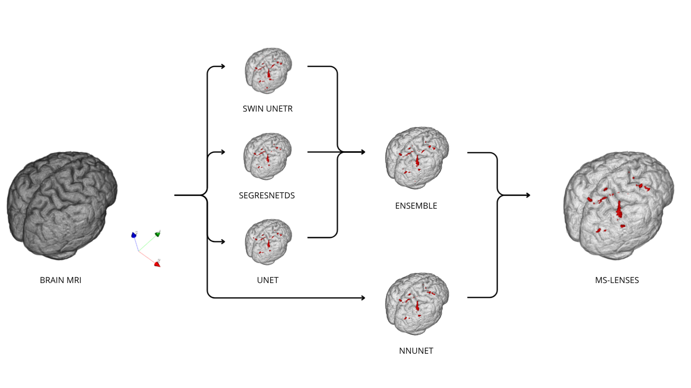
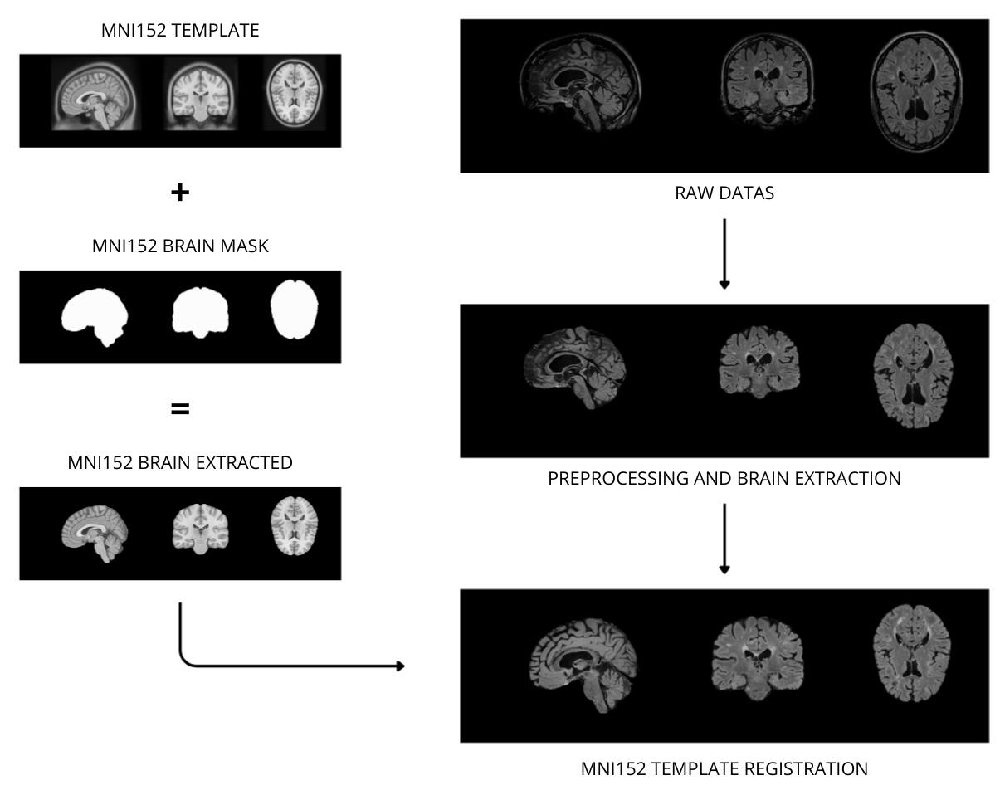
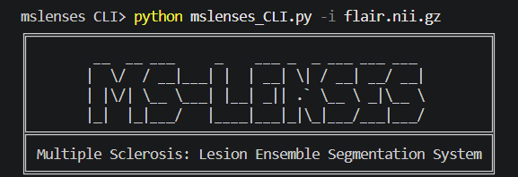
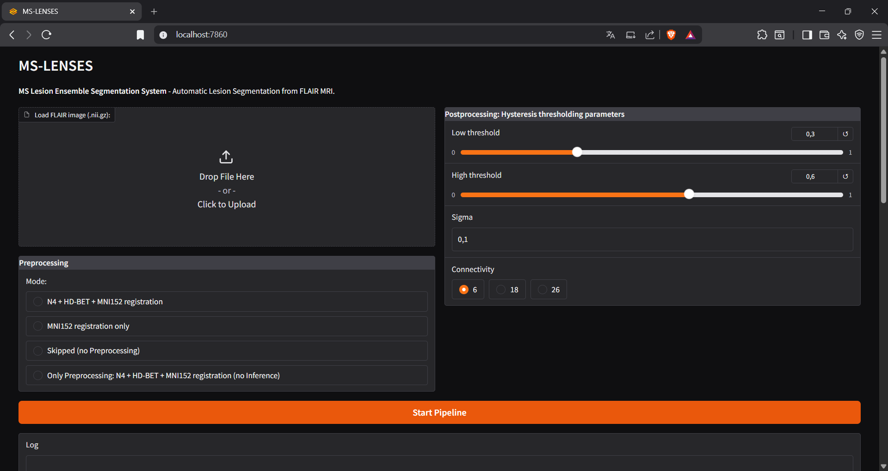

# MS-LENSES: Multiple Sclerosis Lesion ENsemble SEgmentation System [](LICENSE)

A robust deep learning ensemble for automatic segmentation of Multiple Sclerosis lesions in 3D FLAIR MRI scans, combining the strengths of MONAI and nnUNet frameworks.

### Overview

MS-LENSES implements an ensemble approach that combines four state-of-the-art neural network architectures to achieve accurate and reliable MS lesion detection. The system integrates three MONAI-based models (UNet with residual units, Swin-UNETR, and SegResNetDS) with a self-configuring nnUNet model, leveraging their complementary strengths through weighted averaging. The pipeline handles the complete workflow from raw FLAIR images to final segmentation masks, including preprocessing, inference, and postprocessing with adaptive hysteresis thresholding.

Model predictions are combined using validation performance-weighted averaging based on Dice similarity coefficients, with a final 50/50 ensemble between MONAI models and nnUNet to balance their different strengths.



### Key Features

**Preprocessing Pipeline**

The system standardizes input FLAIR images through a multi-step pipeline that ensures consistent data quality. N4 bias field correction removes intensity inhomogeneities caused by scanner artifacts, while HD-BET performs robust brain extraction with GPU acceleration when available. Finally, non-linear SyN registration aligns each image to MNI152 standard space, enabling the neural networks to operate on normalized anatomy. All transformation matrices are preserved to enable accurate mapping back to the original patient space.




**Inference**

Before inference, the data undergoes MONAI preprocessing transformations that prepare it for the neural networks: background voxels are cropped, intensities are normalized, spatial dimensions are padded for network compatibility, and a fixed-size region is extracted through center cropping. The preprocessed data is then passed through all four models, whose predictions are combined using weighted averaging based on their validation performance. The ensemble produces both binary segmentation masks and continuous probability maps for further analysis.

**Advanced Postprocessing**

Beyond standard thresholding, MS-LENSES implements a FLAIR-adaptive hysteresis algorithm that refines segmentation boundaries. The method grows lesion regions from high-confidence seeds, dynamically adjusting probability thresholds based on local FLAIR intensity similarity. This approach allows aggressive expansion in tissue with similar intensities while maintaining strict requirements in dissimilar regions, effectively reducing false positives while preserving true lesion boundaries. All predictions are automatically transformed back to the original patient space, providing multiple output formats including binary masks, probability maps, and the refined hysteresis-thresholded segmentation.

### Requirements

The system has been tested with Python 3.11 and requires Python versions below 3.12 for compatibility with all dependencies. A CUDA-capable GPU is required. For optimal performance during brain extraction, at least 6GB of GPU memory is recommended, though the system will automatically fall back to CPU processing if insufficient memory is detected.

**Important:** PyTorch must be installed separately before installing other dependencies. Install the appropriate version for your system from [pytorch.org](https://pytorch.org/get-started/locally/). For GPU support, ensure CUDA-compatible PyTorch is installed.

Core dependencies:
```txt
monai==1.5.1
antspyx==0.6.1
nibabel==5.3.2
numpy==1.26.4
nnunetv2==2.6.2
HD-BET==2.0.1
```

### Installation

Clone the repository and install dependencies:
```bash
git clone https://github.com/ChiccoSechi/MS-LENSES.git
cd MS-LENSES
pip install -r requirements.txt
```
Then download the pre-trained models from Zenodo:
[Download models.zip from Zenodo](https://zenodo.org/records/18208365/files/models.zip)

Or download directly from terminal:
```bash
# Linux with wget
wget https://zenodo.org/records/18208365/files/models.zip

# Windows/Linux with curl
curl -L -O https://zenodo.org/records/18208365/files/models.zip
```

Extract `models.zip` in the `mslenses/` directory:
```bash
unzip models.zip -d mslenses/
```

This will create the following directories (inside mslenses directory):
- `models/` (contains UNet.pth, SwinUNETR.pth, SegResNetDS.pth)
- `nnUNet/` (contains checkpoint_best.pth)

### Usage (CLI)



All CLI commands must be run from the `mslenses/` directory:
```bash
cd mslenses
```

Process a FLAIR image with default settings:

```bash
python mslenses_CLI.py --input /path/to/flair.nii.gz

# short version:
python mslenses_CLI.py -i /path/to/flair.nii.gz
```

**Advanced Options**

Skip preprocessing for already-processed images (this option allow to skip N4 and Brain Extraction steps):

```bash 
python mslenses_CLI.py -i /path/to/preprocessed_flair.nii.gz --preprocessed

# short version:
python mslenses_CLI.py -i /path/to/preprocessed_flair.nii.gz -p
```

Skip full preprocessing for already-processed images (this option allow to skip N4, Brain Extraction and Registration to MNI152 template):

```bash 
python mslenses_CLI.py -i /path/to/preprocessed_flair.nii.gz --full_preprocessed

# short version:
python mslenses_CLI.py -i /path/to/preprocessed_flair.nii.gz -fp
```

Preprocessing-only execution (without inference or postprocessing)
```bash 
python mslenses_CLI.py -i /path/to/preprocessed_flair.nii.gz --only_preprocessing

# short version:
python mslenses_CLI.py -i /path/to/preprocessed_flair.nii.gz -op
```

*Note: -p, -fp and -op cannot be used together.*

Customize hysteresis thresholding parameters for any experiments (default values are already preset):
```bash
python mslenses_CLI.py -i flair.nii.gz
            --low_threshold 0.2
            --high_threshold 0.7
            --sigma 0.15
            --connectivity 18

# short version:
python mslenses_CLI.py -i flair.nii.gz
            -lt 0.2
            -ht 0.7
            -s 0.15
            -c 18
```

**Batch Processing**

To process multiple FLAIR images at once, you can iterate over a directory from the terminal. Each patient's output will be saved in a dedicated subdirectory.

Linux/Mac (bash):
```bash
for f in /path/to/flairs/*.nii.gz; do
    name=$(basename "$f" .nii.gz)
    python mslenses_CLI.py -i "$f" -o "/path/to/output/$name"
done
```

Windows (PowerShell):
```powershell
Get-ChildItem C:\path\to\flairs\*.nii.gz | ForEach-Object {
    $name = $_.BaseName.Replace(".nii", "")
    python mslenses_CLI.py -i $_.FullName -o "C:\path\to\output\$name"
}
```

*Note: the terminal must be run from the `mslenses/` directory. Relative paths are also supported on both systems.*

### Parameters

- `-i, --input`: Path to input FLAIR image (required, must be .nii.gz format)
- `-p, --preprocessed`: Skip preprocessing (N4 correction and brain extraction) if already done
- `-fp, --full_preprocessed`: Skip preprocessing (N4 correction, brain extraction and MNI152 template registration) if already done
- `-op, --only_preprocessed`: Preprocessing-only execution (skip inference and postprocessing)
- `-lt, --low_threshold`: Minimum probability threshold for hysteresis (default: 0.3)
- `-ht, --high_threshold`: High-confidence seed threshold (default: 0.6)
- `-s, --sigma`: FLAIR similarity bandwidth parameter (default: 0.1)
- `-c, --connectivity`: Voxel neighborhood connectivity, options: 6, 18, 26 (default: 6)

### Gradio UI (Interactive Interface)



MS-LENSES includes an optional web-based graphical interface built with Gradio, providing access to all pipeline features without using the command line.

**Install additional dependencies:** (from the `MS-LENSES/` root directory):
```bash
pip install -r requirements-gradio.txt
```
This automatically installs `requirements.txt` as well, so no separate step is needed.

**Launch the interface**
```bash
cd gradio
python mslenses_UI.py
```

Then open the URL shown in the terminal (default: `http://127.0.0.1:7860`) in your browser.

The interface exposes the same preprocessing modes, hysteresis parameters, and output files as the CLI. Results can be downloaded directly from the browser, alongside 3-axis (axial, sagittal, coronal) visualizations of each output.

To stop the server, press `Ctrl+C` in the terminal. Closing the browser tab does **not** stop the process.

### Docker Hub (Recommended for Quick Start)

**Prerequisites:**
- [Docker](https://docs.docker.com/get-docker/) installed

Two pre-built images are available on Docker Hub: a **CLI image** and a **Gradio UI image** for interactive use via browser.

#### Gradio UI Image

Pull and run the web interface directly. No command line required after startup:

**Pull the image:**
```bash
docker pull chiccosechi/ms-lenses-ui:latest
```

**Run the interface:**
```bash
# Run with GPU (mandatory)
docker run --gpus all --rm -p 7860:7860 chiccosechi/ms-lenses-ui:latest
```

Then open `http://localhost:7860` in your browser. Upload a FLAIR image (`.nii.gz`) through the interface and download results directly from the browser when processing is complete.

**Save outputs automatically to a local folder (optional):**
```bash
docker run --gpus all --rm -p 7860:7860 \
  -v /absolute/path/to/results:/mslenses/directory \
  chiccosechi/ms-lenses-ui:latest
```

To stop the server press `Ctrl+C` in the terminal. Closing the browser tab does **not** stop the container.

#### CLI Image (Scripting & Batch Processing)

Pull and run the pre-built image directly from Docker Hub without manual installation:

**Pull the image:**
```bash
docker pull chiccosechi/ms-lenses:latest
```

**Run analysis (simple approach):**
```bash
# Run with GPU (mandatory)
docker run --gpus all --rm \
  -v /absolute/path/to/results:/mslenses/directory \
  -v /absolute/path/to/flair.nii.gz:/mslenses/input.nii.gz:ro \
  chiccosechi/ms-lenses:latest -i /mslenses/input.nii.gz
```

Mounts input and output to the specific paths expected by the container (`/mslenses/input.nii.gz` and `/mslenses/directory` as defined in the Dockerfile). The input file must be referenced with its full container path `/mslenses/input.nii.gz`.

Results will be saved in your data directory with the same output files as described in [Output Files](#output-files).

**Batch processing:**

Linux/Mac (bash):
```bash
for f in /path/to/flairs/*.nii.gz; do
    name=$(basename "$f" .nii.gz)
    docker run --gpus all --rm \
      -v /path/to/results/$name:/output/$name \
      -v $f:/mslenses/input.nii.gz:ro \
      chiccosechi/ms-lenses:latest -i /mslenses/input.nii.gz -o /output/$name
done
```

Windows (PowerShell):
```powershell
Get-ChildItem C:\path\to\flairs\*.nii.gz | ForEach-Object {
    $name = $_.BaseName.Replace(".nii", "")
    docker run --gpus all --rm `
      -v "C:\path\to\results\$name:/output/$name" `
      -v "$($_.FullName):/mslenses/input.nii.gz:ro" `
      chiccosechi/ms-lenses:latest -i /mslenses/input.nii.gz -o /output/$name
}
```

*Note: each patient's results will be saved in a dedicated subdirectory.*

### Docker (Build from source)

For users who need to customize the Docker image or who prefer to build it locally, MS-LENSES can be built from the repository. Two files are available: **Dockerfile**, for the **CLI version**, and **Dockerfile.ui**, for the **Gradio UI interface**. 

**Clone the repository:**
```bash
git clone https://github.com/ChiccoSechi/MS-LENSES.git
cd MS-LENSES
```

**Download pre-trained models (required):**
```bash
# Linux with wget
wget https://zenodo.org/records/18208365/files/models.zip

# Windows/Linux with curl
curl -L -O https://zenodo.org/records/18208365/files/models.zip

unzip models.zip -d mslenses/
```

#### Gradio UI Docker
**Build Docker image:** (from the `MS-LENSES/` root directory):
```bash
docker build -t [image_name] -f Dockerfile.ui .
```

**Run the interface:**
```bash
# Run with GPU (mandatory)
docker run --gpus all --rm -p 7860:7860 [image_name]
```

*Then open `http://localhost:7860` in your browser. Advanced options (such as mounting the volume) are available in [Gradio UI image](#gradio-ui-image)*


#### CLI Docker
**Build Docker image:** (from the `MS-LENSES/` root directory):
```bash
docker build -t [image_name] .
```

**Run analysis:**
```bash
docker run --gpus all --rm \
  -v [host_output_path]:[container_output_path] \
  -v [host_input_path]:[container_input_path]:ro \
  [image_name] -i [container_input_filename]
```

Replace `[host_output_path]` with your desired output path and `[host_input_path]` with your FLAIR image path.

**Examples:**
```bash
# Create output directory
mkdir output_dir

# Run with GPU (mandatory)
docker run --gpus all --rm \
  -v /absolute/path/to/output_dir:/mslenses/directory \
  -v /absolute/path/to/flair.nii.gz:/input.nii.gz:ro \
  ms-lenses:latest -i /input.nii.gz
```

Results will be saved in the `output_dir/` directory with the same output files as described in [Output Files](#output-files).

**Advanced usage with custom parameters:**
All [parameters](#parameters) available in the standard installation can be used with Docker. Customize thresholds, skip preprocessing, or adjust connectivity as needed.

## Output Files

All results are saved in the `work_dir/` directory:

- `*_preprocessed.nii.gz`: FLAIR image registered to MNI152 space
- `*_preprocessed_binary.nii.gz`: Binary segmentation mask in MNI152 space
- `*_preprocessed_probability.nii.gz`: Probability map in MNI152 space
- `*_orig_binary.nii.gz`: Binary mask in original patient space
- `*_orig_probability.nii.gz`: Probability map in original patient space
- `*_orig_hysteresis.nii.gz`: Final refined segmentation using adaptive thresholding

The hysteresis-thresholded output typically provides the most accurate results, though all intermediate outputs are retained for analysis and research purposes.

## Technical Details

### Adaptive Hysteresis Thresholding

The system implements a FLAIR-adaptive hysteresis algorithm that adjusts probability thresholds based on local intensity similarity. For each candidate voxel, the threshold is computed as:

$$
\text{T}_{\text{adaptive}} = \text{T}_{\text{low}} + (\text{T}_{\text{high}} - \text{T}_{\text{low}}) \times (1 - w)
$$

where $w$ represents FLAIR intensity ($I$) similarity to the seed region:

$$
w = \exp\left(-\frac{(\text{I}_i - \text{I}_j)^2}{2\sigma^2}\right)
$$

This approach allows lesion regions to grow more aggressively in areas with similar FLAIR intensities while maintaining stricter requirements in dissimilar regions, reducing false positives while preserving lesion boundaries.

### Model Weighting

Model contributions are weighted based on validation performance (Dice Similarity Coefficient):

$$
w_i = \frac{D_i^k}{\sum_{j=1}^{N} D_j^k}
$$

where $D_i$ represents the Dice score for model $i$:

UNet: 0.8424
SwinUNETR: 0.8233
SegResNetDS: 0.8550

These weights can be adjusted by modifying the `_models_weights()` function in [`utils.py`](mslenses/utils.py).


### Hardware Considerations

- **GPU (CUDA)**: Mandatory for practical use. Inference and preprocessing takes some minutes.
- HD-BET automatically falls back to CPU if GPU memory is insufficient (< 6GB).
- MS-LENSES has been tested on an NVIDIA RTX 2070 (8GB VRAM) without issues.

Note that ANTs preprocessing (N4 bias correction and MNI152 registration) always runs on CPU regardless of GPU availability. N4 correction is particularly time-intensive and heavily dependent on CPU performance. 

### Citation
**nnUNetv2 - [(link)](https://github.com/MIC-DKFZ/nnUNet)**
Isensee, F., Jaeger, P. F., Kohl, S. A., Petersen, J., & Maier-Hein, K. H. (2021). nnU-Net: a self-configuring  method for deep learning-based biomedical image segmentation. Nature methods, 18(2), 203-211.

**HD_BET - [(link)](https://github.com/MIC-DKFZ/HD-BET)**
Isensee F, Schell M, Tursunova I, Brugnara G, Bonekamp D, Neuberger U, Wick A, Schlemmer HP, Heiland S, Wick W, Bendszus M, Maier-Hein KH, Kickingereder P.
Automated brain extraction of multi-sequence MRI using artificial neural networks. Hum Brain Mapp. 2019; 1–13. https://doi.org/10.1002/hbm.24750

**MONAI - [(link)](https://project-monai.github.io/core.html)**
M Jorge Cardoso, Wenqi Li, Richard Brown, Nic Ma, Eric Kerfoot, Yiheng Wang, Benjamin Murrey, Andriy Myronenko, Can Zhao, Dong Yang, Vishwesh Nath, Yufan He, Ziyue Xu, Ali Hatamizadeh, Andriy Myronenko, Wentao Zhu, Yun Liu, Mingxin Zheng, Yucheng Tang, Isaac Yang, Michael Zephyr, Behrooz Hashemian, Sachidanand Alle, Mohammad Zalbagi Darestani, Charlie Budd, Marc Modat, Tom Vercauteren, Guotai Wang, Yiwen Li, Yipeng Hu, Yunguan Fu, Benjamin Gorman, Hans Johnson, Brad Genereaux, Barbaros S Erdal, Vikash Gupta, Andres Diaz-Pinto, Andre Dourson, Lena Maier-Hein, Paul F Jaeger, Michael Baumgartner, Jayashree Kalpathy-Cramer, Mona Flores, Justin Kirby, Lee A D Cooper, Holger R Roth, Daguang Xu, David Bericat, Ralf Floca, S Kevin Zhou, Haris Shuaib, Keyvan Farahani, Klaus H Maier-Hein, Stephen Aylward, Prerna Dogra, Sebastien Ourselin, Andrew Feng
MONAI: An open-source framework for deep learning in healthcare (2022)
https://doi.org/10.48550/arXiv.2211.02701

**ANTS - [(link)](https://github.com/ANTsX/ANTsPy)**

**MNI152 Template (ICBM 2009a Nonlinear Asymmetric) - [(link)](https://www.bic.mni.mcgill.ca/ServicesAtlases/ICBM152NLin2009)**
VS Fonov, AC Evans, K Botteron, CR Almli, RC McKinstry, DL Collins and BDCG, 
Unbiased average age-appropriate atlases for pediatric studies, NeuroImage,Volume 54, Issue 1, January 2011, ISSN 1053–8119, 
DOI: https://doi.org/10.1016/j.neuroimage.2010.07.033

VS Fonov, AC Evans, RC McKinstry, CR Almli and DL Collins, 
Unbiased nonlinear average age-appropriate brain templates from birth to adulthood, NeuroImage, Volume 47, Supplement 1, July 2009, Page S102 Organization for Human Brain Mapping 2009 Annual Meeting, 
DOI: http://dx.doi.org/10.1016/S1053-8119(09)70884-5

If you find this project useful for your research, please consider citing it and leaving a star on GitHub.

## License

This project is released under the Apache License 2.0. See the [LICENSE](LICENSE) file for details.

This project is provided for research and educational purposes. Please check the individual licenses of the underlying frameworks (MONAI, nnUNet, ANTs, HD-BET) for specific usage restrictions.

**DISCLAIMER:** MS-LENSES is intended strictly for research purposes. This tool has not undergone clinical validation and is not approved for diagnostic or therapeutic applications in clinical settings.